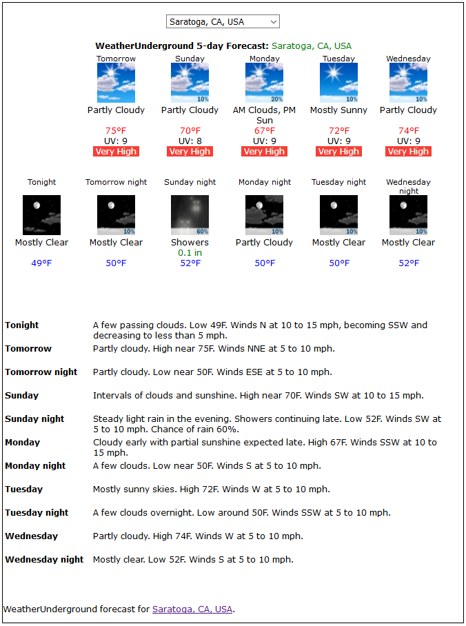

# WU/TWC International forecast formatting script - multilingual

Note: on 27-Feb-2019, WU announced the method to acquire WU/TWC API keys which are available ONLY for stations submitting PWS data to WeatherUnderground.com. As such, you MUST be a member of WeatherUnderground and have a PWS submitting data in order to acquire an API key to use this script.

This script is based on the WU-forecast.php script which is now deprecated as WeatherUnderground has turned off the WU API keys as of 21-Mar-2019.  
The script REQUIRES an API KEY for api.weather.com (which is NOT the same as the old WU API key). The key is available ONLY to PWS data submitters to Wunderground.com.  
So, in order to use this script you need to:

1.  Have your weather station submit data to WeatherUnderground as a WU member.
2.  Register for and acquire a free API key by the procedure below.
3.  Use this script ONLY on your personal, non-commercial weather station website.
4.  Leave attribution (and hotlink) to WeatherUnderground.com as the source of the data.

Adhere to these four requirements, and you should have fair use of this data from WeatherUnderground/weather.com.

## How to get a WU/TWC API Key

*   Use your browser to open **[https://www.wunderground.com/member/api-keys](https://www.wunderground.com/member/api-keys)**
*   If you are not logged in, you will be asked to. The system will also verify that you have a PWS uploading to the system.  

*   You will then see a blank box below “_Your API keys_”.  
    Agree to the new Terms and Conditions by clicking in the small box next to “_I agree_”, click on the blue “_GENERATE_” box, and your new key will be created.  

    The key will be masked on the screen, but you can use the “_Show_” link below the box to see it.  
    There is also another blue box, which, when clicked, copies the key to your clipboard.
*   Save that key in the **$WCAPIkey** in the script for standalone use, or if using a Saratoga template, save in _Settings.php_ in a **$SITE['WCAPIkey']** setting.  

## Settings in the WC-forecast.php script
```
// Settings ---------------------------------------------------------------
//REQUIRED: a WU API KEY.. sign up at https://www.wunderground.com/member/api-keys
$WCAPIkey = 'specify-for-standalone-use-here'; // use this only for standalone / non-template use
// NOTE: if using the Saratoga template, add to Settings.php a line with:
//    $SITE['WCAPIkey'] = 'your-api-key-here';
// and that will enable the script to operate correctly in your template
//
// Select which units will be used for the displays:
//
//$WCunits  = 'e';  // 'e'= US units F,mph,inHg,in,in
$WCunits  = 'm';  // 'm'= metric   C,km/h,hPa,mm,cm
//$WCunits  = 'h';  // 'h'= UK units C,mph,mb,mm,cm
//$WCunits  = 's';  // 's'= SI units C,m/s,hPa,mm,cm
//
$iconDir ='./forecast/images/';	// directory for carterlake icons './forecast/images/'
$iconType = '.jpg'; // default type='.jpg'
//                     use '.gif' for animated icons from http://www.meteotreviglio.com/
//
//
$WC_LOC = 'Saratoga, CA, USA|37.27465,-122.02295';
//
// The optional multi-city forecast .. make sure the first entry is for the $WC_LOC location
// The contents will be replaced by $SITE['WCforecasts'] if specified in your Settings.php
//*

$WCforecasts = array(
 // Location name to display|lat,long  (separated by | character)
'Saratoga, CA, USA|37.27465,-122.02295',
'Auckland, NZ|-36.910,174.771', // Awhitu, Waiuku New Zealand
'Assen, NL|53.02277,6.59037',
'Blankenburg, DE|51.8089941,10.9080649',
'Cheyenne, WY, USA|41.144259,-104.83497',
'Carcassonne, FR|43.2077801,2.2790407',
'Braniewo, PL|54.3793635,19.7853585',
'Omaha, NE, USA|41.19043,-96.13114',
'Johanngeorgenstadt, DE|50.439339,12.706085',
'Athens, GR|37.97830,23.715363',
'Haifa, IL|32.7996029,34.9467358',
'Tahoe Vista, CA, USA|39.2403,-120.0528',
'Auburn, CA, USA|38.8962,-121.0789',
);
//*/
$commaDecimal = false;                 // set to true to process numbers with a comma for a decimal point
//
$maxWidth = '640px';                   // max width of tables (could be '100%')
$maxForecastLegendWords = 4;           // more words in forecast legend than this number will use our forecast words
$autoSetTemplate = true;               // =true; set icons based on wide/narrow template design
//                                     // =false; don't autoset maxWidth based on Saratoga wide/narrow
$foldIconRow = true;                   // =true; display icons in rows of 5 if long texts are found
$iconRowDayNight = true;               // =false; 9 icons in a row, folded over if long texts.
//                                     // =true;  icons always in two rows Day over Night
$cacheFileDir = './';                  // default cache file directory
$cacheName = "WC-forecast-json.txt";   // locally cached page from WC
$refetchSeconds = 3600;                // cache lifetime (3600sec = 60 minutes)
$charsetOutput = 'ISO-8859-1';         // default character encoding of output ='ISO-8859-1' for Saratoga templates
$lang = 'en';                          // default language ='en' for English
// ---- end of settings ---------------------------------------------------</pre>
```
<dl>

<dt>**$WCAPIkey = 'specify-for-standalone-use-here';**</dt>

<dd>This setting is for **standalone** use (do not change this for Saratoga templates).  
Register for a WU/TWC API Key at https://www.wunderground.com/member/api-keys and replace _specify-for-standalone-use-here_i> with the registered API key. The script will nag you if this has not been done.  

**For Saratoga template users**, do the registration at the WU API site above, then put your API key in your _Settings.php_ as:  

$SITE['WUAPIkey'] = '_your-key-here_';  

to allow easy future updates of the WC-forecast.php script by simple replacement.</dd>

<dt>**$WCunits** **= 'm';**</dt>

<dd>Use this to set the units used in the forecasts:  
**= 'e';** // 'e'= US units F,mph,inHg,in,in  
**= 'm';** // 'm'= metric C,km/h,hPa,mm,cm (default)  
**= 'h';** // 'h'= UK units C,mph,mb,mm,cm  
**= 's';** // 's'= SI units C,m/s,hPa,mm,cm  

For Saratoga template users, insert $SITE['WCunits'] = 'm';in your Settings.php.</dd>

<dt>**$iconDir**</dt>

<dd>This setting controls whether to display the NOAA-styled icons or the WeatherUnderground icons on the forecast display.  
Set $iconDir to the relative file path to the Saratoga Icon set (same set as used with the WXSIM plaintext-parser.php script).  
Be sure to include the trailing slash in the directory specification as shown in the example above.  
**Saratoga template users:** Use the _Settings.php_ entry for **$SITE['fcsticonsdir']** to specify this value.</dd>

<dt>**$iconType**</dt>

<dd>This setting controls the extension (type) for the icon to be displayed.  
**='.jpg';** for the default Saratoga JPG icon set.  
**='.gif';** for the Meteotriviglio animated GIF icon set.  
**Saratoga template users:** Use the _Settings.php_ entry for **$SITE['fcsticonstype']** to specify this value.</dd>

<dt>**$WC_LOC = 'Saratoga, CA, USA|37.27465,-122.02295';**</dt>

<dd>This is the default location for the forecast.  
**Saratoga template users:** Use the _Settings.php_ entry for **$SITE['fcsturlWC']** to specify this value.</dd>

<dt>**$WCforecasts = array(  
// Location name to display|lat,long (separated by | character)  
'Saratoga, CA, USA|37.27465,-122.02295',  
'Auckland, NZ|-36.910,174.771', // Awhitu, Waiuku New Zealand  
...  
);**</dt>

<dd>This setting is an alternative method of specifying the locations for forecasts. If used, it will override the main location specified in the $WC_LOC above and allow the viewer to choose between forecasts for different areas based on a drop-down list box selection.  
**Saratoga template users**: Use the _Settings.php_ entry for **$SITE['WCforecasts'] = array(...);** to specify the list of sites and lat/long.</dd>

<dt>**$maxWidth**</dt>

<dd>This variable controls the maximum width of the tables for the icons and text display. It may be in pixels (as shown), or '100%'. The Saratoga/NOAA icons are 55px wide and there are up to 14 icons, so beware setting this width too small as the display may be quite strange.</dd>

<dt>**$maxIcons**</dt>

<dd>This variable specifies the maximum number of icons to display in the graphical part of the forecast. Some forecast locations may have up to 5 days of forecast (10 icons) so be careful how wide the forecast may become on the page.</dd>

<dt>**$cacheFileDir**</dt>

<dd>This setting specifies the directory to store the cache files. The default is the same directory in which the script is located.  
Include the trailing slash in the directory specification.  
**Saratoga template users:** Use the _Settings.php_ entry for **$SITE['cacheFileDir']** to specify this value.</dd>

<dt>**$cacheName**</dt>

<dd>This variable specifies the name of the cache file for the WU forecast page. Note that unit and language values are appended to the file name so the change of units or language can be honored.</dd>

<dt>**$refetchSeconds**</dt>

<dd>This variable specifies the cache lifetime, or how long to use the cache before reloading a copy from Weather Underground. The default is 3600 seconds (60 minutes). Forecasts don't change very often, so please don't reduce it below 60 minutes to minimize your API access count and keep it to the free Developer API range.</dd>

<dt>**$foldIconRow**</dt>

<dd>This setting controls 'folding' of the icons into two rows if the aggregate width of characters exceeds the $maxSize dimension in pixels.  
**= true;** is the default (fold the row)  
**= false;** to select not to fold the row.  
**Saratoga template users:** Use the _Settings.php_ entry for **$SITE['foldIconRow']** to specify this value.</dd>

<dt>**$iconRowDayNight**</dt>

<dd>This setting overrides **$foldIconRow** setting and always displays two rows of icons - Day over Night icon  
**=true;** to always display Day over Night icons  
**=false;** to follow the $foldIconRow setting (use two rows only if text conditions are two long to fit in one row)</dd>

</dl>

More documentation is contained in the script itself about variable names/arrays made available, and the contents. The samples below serve to illustrate some of the possible usages on your weather website.

## Usage samples

```
<?php  
$doIncludeWC = true;  
include("WC-forecast.php"); ?>
```

You can also include it 'silently' and print just a few (or all) the contents where you'd like it on the page

<?php  
$doPrintWC = false;  
include("WC-forecast.php"); ?>  

then on your page, the following code would display just the current and next time period forecast:
```
<table>  
<tr align="center" valign="top">  
<?php print "<td>$WCforecasticons[0]</td><td>$WCforecasticons[1]</td>\n"; ?>  
</tr>  
<tr align="center" valign="top">  
<?php print "<td>$WCforecasttemp[0]</td><td>$WCforecasttemp[1]</td>\n"; ?>  
</tr>  
</table>
```

Or if you'd like to include the immediate forecast with text for the next two cycles:
```
<table>  
<tr valign="top">  
<?php print "<td align=\"center\">$WCforecasticons[0]<br />$WCforecasttemp[0]</td>\n"; ?>  
<?php print "<td align=\"left\" valign=\"middle\">$WCforecasttext[0]</td>\n"; ?>  
</tr>  
<tr valign="top">  
<?php print "<td align=\"center\">$WCforecasticons[1]<br />$WCforecasttemp[1]</td>\n"; ?>  
<?php print "<td align=\"left\" valign=\"middle\">$WCforecasttext[1]</td>\n"; ?>  
</tr>  
</table>
```

If you'd like to style the output, you can easily do so by setting a CSS for class **WCforecast** either in your CSS file or on the page including the WC-forecast.php (in include mode):

```
<style type="text/css">    
.WCforecast {    
    font-family: Verdana, Arial, Helvetica, sans-serif;    
    font-size: 9pt;    
}    
</style>
```

## Installation of WC-forecast.php

Download **WC-forecast.php** this package.

Optionally, download the **Icon set**, and upload to /forecast/images directory.

Change settings in **WC-forecast.php** for the $WC_URL address and the address of the icons if necessary and upload the modified WC-forecast.php to your website.

**Download**:[ **Icon Set** ](../forecast-icons/saratoga-icons2.zip)(upload to your website in the **/forecast/images** directory)  
This is the same icon set used in the Saratoga Base-World/Base-USA Template set.

# Sample Output


